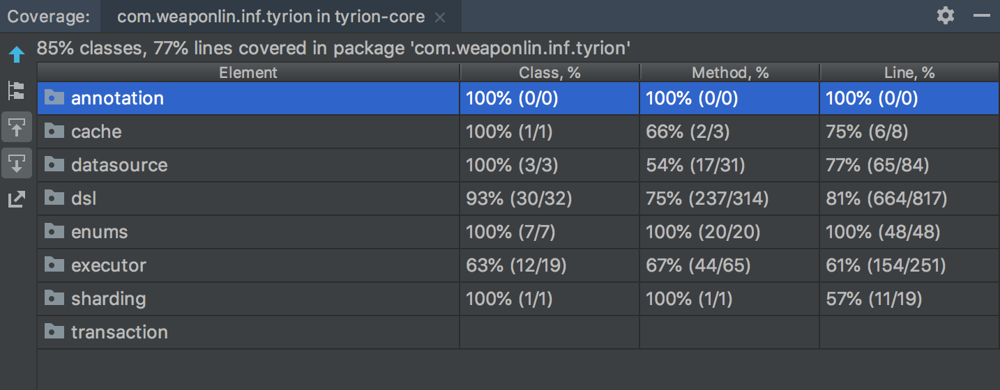
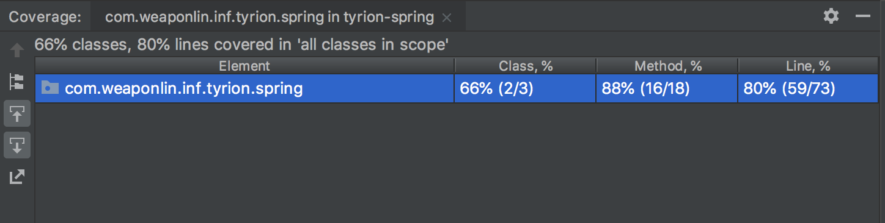

# tyrion

一款编程式、轻量级的持久层框架  

## 1 Architecture

TODO 整体情况

### 1.1 DSL
TODO

### 1.2 连接池
TODO

### 1.3 
TODO


## 2 Quick Start

在开始之前，先介绍一下一些约定

(1) 我们需要在实体类上标注@Table注解，同时需要填写database和table，其次在属性上面需要添加@Column注解，表明该属性对应数据库表的字段名
```java
@Table(database = "demo", table = "user")
public class User {

    @Id
    @Column(column = "id")
    private Long id;

    @Column(column = "name")
    private String name;

    @Column(column = "gender")
    private String gender;

    @Column(column = "age")
    private Integer age;
}
```

(2) Executor用法

```java
// 定义UserDao接口
public interface UserDao {
    List getAllUser();
    int addUser(User user);
    // 其他接口忽略
}
```

UserDaoImpl里头需要定义Executor，最终用来执行SQL语句
```java
public class UserDaoImpl implements UserDao {
    private final Executor executor;
    public UserDaoImpl(@NonNull Executor executor) {
        this.executor = executor;
    }

    @Override
    public List<User> getAllUser() {
        SQLParameter sqlParameter = DSL.select()
                .from(table(User.class))
                .build();
        return executor.selectList(sqlParameter);
    }

    @Override
    public int addUser(User user) {
        return executor.insert(user);
    }
}
```

### 2.1 原生demo

(1) 创建PooledDataSource & Executor & UserDao实例
```java
PooledDatasource pooledDatasource = new PooledDatasource(
                "com.mysql.cj.jdbc.Driver",
                "jdbc:mysql://localhost:3306/demo?characterEncoding=utf8&useSSL=false&serverTimezone=UTC",
                "root",
                "weaponlin"
        );
Executor executor = new DefaultExecutor(pooledDatasource);
userDao = new UserDaoImpl(executor);
```

(2) 接下来就可以直接执行SQL，更多SQL执行可以查看RawApplication类
```java
@Test
    public void get_all_user() {
        List<User> users = userDao.getAllUser();
        System.out.println(users);
    }

    @Test
    public void add_user() {
        User user = new User().setId(66L).setAge(10).setName("weapon").setGender("male");

        int affectedRows = userDao.addUser(user);
        assertEquals(1, affectedRows);

        User u = userDao.getUser(66L);
        assertNotNull(u);
        assertEquals(66L, u.getId().longValue());
        assertEquals(10, u.getAge().intValue());
        assertEquals("weapon", u.getName());
        assertEquals("male", u.getGender());

        affectedRows = userDao.deleteUser(66L);
        assertEquals(1, affectedRows);

        u = userDao.getUser(66L);
        assertNull(u);
    }
```


### 2.2 集成Spring demo

(1) 配置applicationContext
```xml
<!-- 1.配置数据源 -->
    <bean id="dataSource" class="com.weaponlin.inf.tyrion.datasource.PooledDatasource">
        <constructor-arg name="driver" value="com.mysql.cj.jdbc.Driver"></constructor-arg>
        <constructor-arg name="url"
                  value="jdbc:mysql://localhost:3306/demo?characterEncoding=utf8&amp;useSSL=false&amp;serverTimezone=UTC"></constructor-arg>
        <constructor-arg name="username" value="root"></constructor-arg>
        <constructor-arg name="password" value="weaponlin"></constructor-arg>
    </bean>

    <bean id="jdbcTemplateExecutor" class="com.weaponlin.inf.tyrion.spring.executor.JdbcTemplateExecutor">
        <constructor-arg name="pooledDatasource" ref="dataSource"/>
    </bean>

    <bean id="userDao" class="com.weaponlin.inf.tyrion.demo.dao.impl.UserDaoImpl">
        <constructor-arg name="executor" ref="jdbcTemplateExecutor"/>
    </bean>
```

(2) 直接使用userDao

```java
@RunWith(SpringJUnit4ClassRunner.class)
@ContextConfiguration(locations = {"classpath:applicationContext.xml"})
public class SpringApplication {

    @Autowired
    private UserDao userDao;

    @Test
    public void get_all_user() {
        List<User> users = userDao.getAllUser();
        System.out.println(users);
    }

    @Test
    public void add_user() {
        User user = new User().setId(66L).setAge(10).setName("weapon").setGender("male");

        int affectedRows = userDao.addUser(user);
        assertEquals(1, affectedRows);

        User u = userDao.getUser(66L);
        assertNotNull(u);
        assertEquals(66L, u.getId().longValue());
        assertEquals(10, u.getAge().intValue());
        assertEquals("weapon", u.getName());
        assertEquals("male", u.getGender());

        affectedRows = userDao.deleteUser(66L);
        assertEquals(1, affectedRows);

        u = userDao.getUser(66L);
        assertNull(u);
    }
}
```


## 3 开发进度(in progress)
- [x] SQL DSL
- [x] 自定义数据源缓存池
- [x] 执行器，包含原生实现 & Spring JdbcTemplate集成
- [ ] 支持分库分表
- [ ] 支持原生SQL
- [ ] 支持多表连接查询
- [ ] 集成Spring Boot
- [ ] 支持返回主键
- [ ] 插件化 

## 4 测试相关

(1) tyrion-core 测试覆盖率



(2) tyrion-spring 测试覆盖率



## 5 User Feedback


